# Manual do Usuário — Simulador PROJUDI (simu-projudi)

**Versão:** 0.1 (em elaboração — capítulo por capítulo)
**Última atualização:** 2026-09-19

---

## Declaração de Uso

Este manual descreve o **Simulador PROJUDI**, plataforma acadêmica do Núcleo de Prática Jurídica
(NPJ), usada para que estudantes de Direito pratiquem o peticionamento e a movimentação processual
eletrônica em ambiente controlado. **Todos os dados, processos, nomes de partes e documentos usados
neste simulador são fictícios**, criados exclusivamente para fins didáticos. Nada aqui tem valor
jurídico real nem produz qualquer efeito fora do ambiente acadêmico.

---

## Índice

1. [Glossário de Abreviações e Siglas](#glossario)
2. [Introdução](#introducao)
3. [Primeiros Passos](#primeiros-passos)
   1. [Como se Cadastrar no Sistema](#como-se-cadastrar)
   2. [O que Acontece Logo Após o Cadastro](#apos-cadastro)
   3. [Como Fazer Login](#como-fazer-login)
   4. [Para onde Cada Perfil é Redirecionado](#redirecionamento)
4. [Capítulo do Admin](#capitulo-admin)
   1. [Painel de Controle](#admin-painel)
   2. [Como Aprovar um Cadastro Pendente](#admin-aprovar-cadastro)
   3. [Como Criar um Ciclo de Simulação](#admin-criar-ciclo)
   4. [Como Criar um Grupo de Trabalho e Adicionar Alunos](#admin-criar-grupo)
5. [Capítulo do Coordenador](#capitulo-coordenador)
6. [Capítulo do Professor](#capitulo-professor)
   1. [Como Vincular um Aluno a um Grupo de Trabalho](#professor-vincular-aluno-grupo)
   2. [Como Avaliar uma Movimentação (Atribuir Nota)](#professor-avaliar-movimentacao)
   3. [Como Bloquear/Desativar um Cadastro](#professor-bloquear-cadastro)
7. [Capítulo do Aluno](#capitulo-aluno)
   1. [Como Cadastrar um Processo](#aluno-cadastrar-processo)
   2. [Detalhe do Processo](#aluno-detalhe-processo)
   3. [Como Movimentar um Processo](#aluno-movimentar-processo)
   4. [Como Anexar um Documento em uma Movimentação](#aluno-anexar-documento)
   5. [Como Usar o Editor On-line para Criar e Assinar um Documento](#aluno-editor-online)
   6. [Papel de Serventia/Cartório: Vincular um Grupo a um Processo](#aluno-sc-vincular-grupo)
8. [Notificações do Sistema](#notificacoes-sistema)

*(Este índice será expandido conforme novos capítulos forem escritos.)*

---

## Glossário de Abreviações e Siglas

| Sigla | Significado |
|---|---|
| NPJ | Núcleo de Prática Jurídica |
| PROJUDI | Processo Judicial Digital — sistema eletrônico oficial do TJGO, do qual o simu-projudi é um simulador acadêmico |
| TJGO | Tribunal de Justiça do Estado de Goiás |
| CNJ | Conselho Nacional de Justiça |
| SC | Serventia/Cartório — papel de grupo de trabalho responsável por vincular grupos a um processo (ver [Capítulo do Aluno, seção 6](#aluno-sc-vincular-grupo)) |
| APA | Advogados do Polo Ativo — papel de grupo de trabalho que representa a parte autora de um processo |
| APP | Advogados do Polo Passivo — papel de grupo de trabalho que representa a parte ré de um processo |
| MP | Ministério Público — papel de grupo de trabalho |
| JZ | Juiz — papel de grupo de trabalho |
| SIC | Simulador (usado neste manual como sinônimo de "simu-projudi" quando o contexto já deixa claro que não se trata do PROJUDI real) |

*Outros termos jurídicos serão acrescentados aqui conforme aparecerem em novos capítulos.)*

---

## Introdução

O **Simulador PROJUDI** (simu-projudi) é uma plataforma acadêmica desenvolvida para estudantes de
graduação em Direito que integram o Núcleo de Prática Jurídica (NPJ) de suas instituições de
ensino. O sistema reproduz, de forma didática e em ambiente controlado, a interface e os fluxos
operacionais do PROJUDI — o sistema oficial de processo judicial eletrônico utilizado pelo
Tribunal de Justiça de Goiás (TJGO).

O objetivo central da plataforma é proporcionar ao estudante a vivência prática do processo
judicial eletrônico — cadastro de processos, peticionamento, movimentações, prazos e avaliação —
antes de sua inserção no mercado de trabalho ou em estágios supervisionados, dentro de um ambiente
seguro, sem qualquer risco de impacto em processos reais. Todos os dados manipulados no simulador
(processos, partes, documentos) são fictícios, como já descrito na Declaração de Uso acima.

O simulador organiza o uso em torno de alguns conceitos centrais, que aparecem repetidamente ao
longo deste manual:

- **Ciclo de Simulação**: corresponde a um período letivo (ex. um semestre). Cada ciclo é
  conduzido por um Professor (o "coordenador" do ciclo) e reúne os alunos participantes daquele
  período.
- **Grupo de Trabalho**: dentro de um ciclo, os alunos são organizados em grupos, e cada grupo
  assume um papel processual num ou mais processos — por exemplo, representando o polo ativo
  (**APA**), o polo passivo (**APP**), atuando como Ministério Público (**MP**), Juízo (**JZ**) ou
  Serventia/Cartório (**SC**). Ver o [Glossário](#glossario) para a lista completa desses papéis.
- **Processo Judicial**: o processo fictício em si, ao qual um ou mais grupos de trabalho são
  vinculados, e sobre o qual as movimentações processuais são praticadas.
- **Movimentação Processual**: cada ato praticado dentro de um processo (uma petição, um despacho,
  a juntada de um documento etc.), sujeita — conforme o papel de quem a pratica — a diferentes
  regras de permissão, e passível de avaliação (nota) por um Professor.

O manual está organizado por perfil de usuário (Admin, Coordenador, Professor, Aluno), cobrindo em
cada capítulo as ações que aquele perfil pode realizar no sistema. Recomenda-se ler primeiro a
seção ["Primeiros Passos"](#primeiros-passos), comum a todos os perfis, antes de avançar para o
capítulo do seu perfil específico.

---

## Primeiros Passos

Esta seção reúne os passos comuns a **todos os perfis de usuário**: cadastro, aprovação e login.

### 1. Como se Cadastrar no Sistema

*Disponível para: qualquer pessoa, sem necessidade de login prévio. Pré-requisito: nenhum.*

1. Acesse a tela inicial do simulador (`/acesso`) e clique em **Solicitar Cadastro**.
2. Preencha **Nome Completo**, **Email** e crie uma **Senha** (mínimo 8 caracteres; não pode ser só
   números, nem uma senha muito comum, nem parecida com seus dados pessoais).
3. Repita a senha em **Confirmação de Senha**.
4. Clique em **Criar Usuário**.

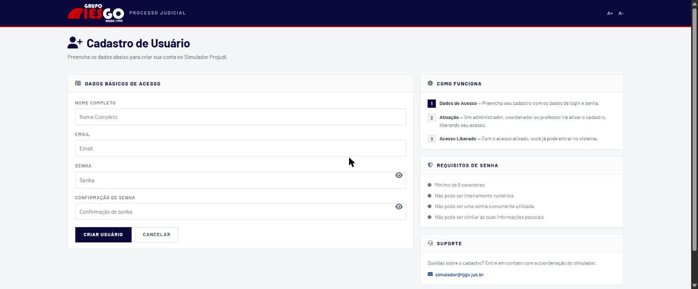

Exemplo de formulário preenchido com dados fictícios:

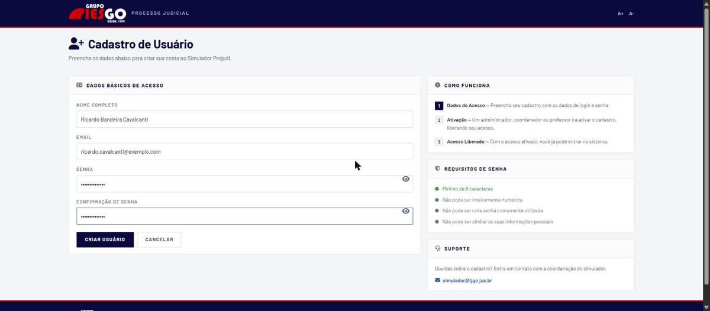

**Resultado:** você volta para a tela de login com a mensagem "Cadastro realizado com sucesso!
Aguarde a aprovação de um responsável para acessar o sistema." Seu cadastro fica com status
**Pendente** — é o **Coordenador/Professor** do seu Núcleo de Prática Jurídica quem confirma sua matrícula e
libera seu acesso, atribuindo seu cargo de simulação dentro de um ciclo.

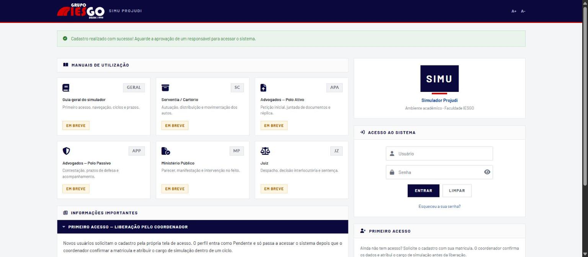

> ⚠️ **Atenção:** enquanto seu cadastro estiver Pendente, se você tentar fazer login o sistema vai
> mostrar a mensagem genérica "Por favor, entre com um usuário e senha corretos" — **isso não
> significa que sua senha está errada**, apenas que seu acesso ainda não foi liberado. Aguarde a
> confirmação do Coordenador antes de tentar novamente.

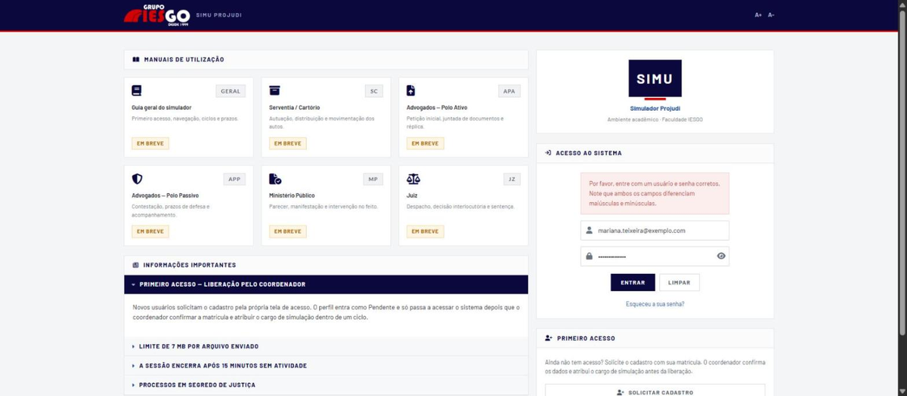

---

### 2. O que Acontece Logo Após o Cadastro

Enquanto o Coordenador do seu Núcleo de Prática Jurídica não confirmar seu cadastro, seu perfil
fica como **Pendente**. Nessa fase:

- Você **não consegue entrar no sistema** — qualquer tentativa de login mostra a mensagem padrão de
  usuário/senha incorretos (ver aviso na seção anterior), mesmo com a senha certa.
- Não existe uma tela específica de "aguardando aprovação" para consultar — o único jeito de saber
  se seu cadastro já foi liberado é tentar fazer login novamente.

---

### 3. Como Fazer Login

*Disponível para: qualquer usuário com cadastro **Ativo** (aprovado por um Coordenador, Admin ou
Professor).*

1. Na tela inicial do simulador, preencha **Usuário** (seu e-mail de cadastro) e **Senha**.
2. Clique em **Entrar**.

**Resultado:** o sistema confere usuário e senha e leva você para a tela inicial do seu perfil (ver
próxima seção, "Para onde cada perfil é redirecionado").

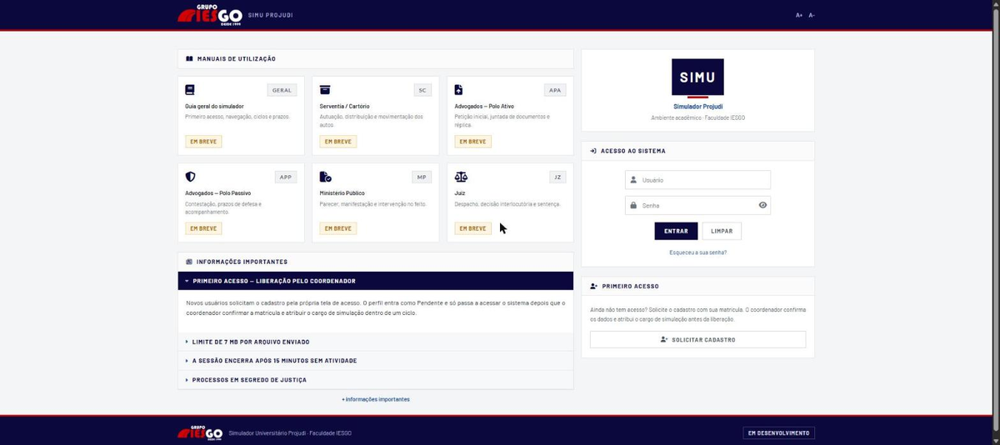

> ⚠️ Se aparecer a mensagem "Por favor, entre com um usuário e senha corretos", confira se digitou
> tudo certo (o sistema diferencia maiúsculas de minúsculas) — e lembre que essa mesma mensagem
> aparece também quando o cadastro ainda está Pendente (ver seção anterior).

---

### 4. Para onde Cada Perfil é Redirecionado

**Admin, Coordenador e Professor** caem no mesmo lugar: o **Painel de Controle**
(`/acesso/painel-administrativo/`), com a Gestão de Ciclos de Simulação, o Resumo do Semestre e os
atalhos de "Ações Rápidas". A tela é **visualmente idêntica** para os três perfis — o que muda é o
que cada um enxerga e pode fazer dentro dela (ver o capítulo de cada perfil para as diferenças).

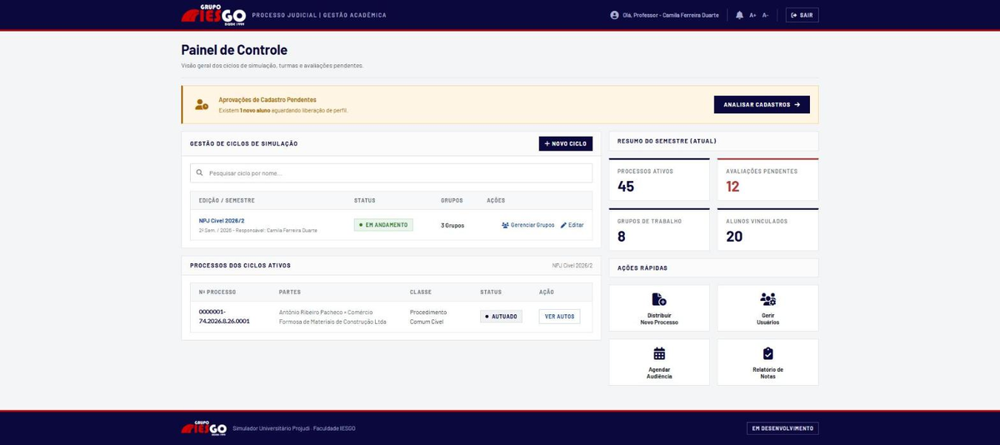

**Aluno**: o destino depende de já estar vinculado a um grupo de trabalho ou não.

- **Ainda sem vínculo a nenhum grupo/ciclo de simulação**: é direcionado a uma tela de
  **Boas-vindas** (`/ciclos/boas-vindas/`) com o aviso "Aguardando Vínculo" — explicando que é o
  professor ou o coordenador do ciclo quem inclui o aluno em um grupo de trabalho e define seu
  cargo na simulação. Enquanto isso não acontece, não há processo nenhum para acompanhar.

  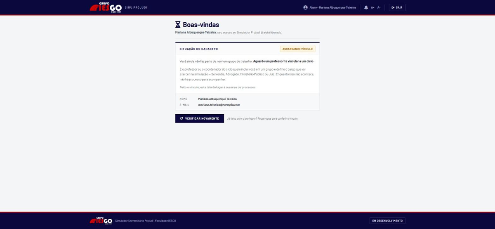

- **Já vinculado a um grupo**: é direcionado direto para a **Área do Aluno**
  (`/processos/area-servidor/`), já mostrando o grupo, o cargo de simulação e os processos
  vinculados.

  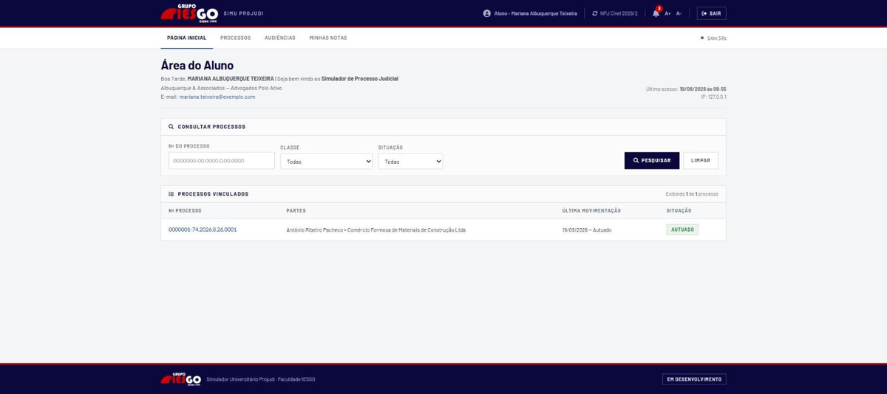

> ℹ️ **Aluno vinculado a mais de um ciclo ao mesmo tempo**: se o Aluno pertence a um grupo de
> trabalho em mais de um ciclo "Em andamento", o login não vai direto para a Área do Aluno — antes
> disso aparece a tela **"Selecione o Ciclo"**, pedindo para escolher em qual dos ciclos deseja
> atuar naquele momento.
>
> 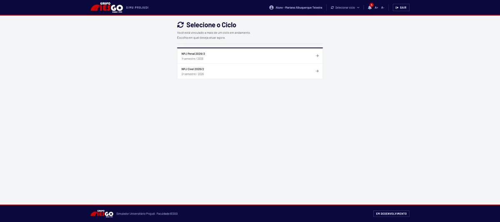
>
> Depois de escolhido, o ciclo ativo fica marcado no cabeçalho (ícone de seta circular, ao lado do
> nome do usuário). Clicando nele, o Aluno pode **trocar de ciclo ativo** a qualquer momento, sem
> precisar sair e logar de novo — o sistema pede para escolher de novo apenas no próximo login.
>
> 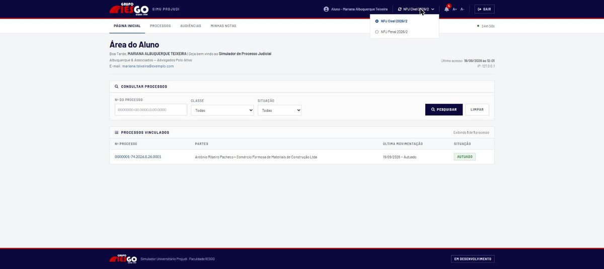
>
> Esse seletor de ciclo no cabeçalho aparece **só para o Aluno** — Admin, Coordenador e Professor
> não precisam dele porque o Painel de Controle deles já mostra todos os seus ciclos de uma vez.

---

---

## Capítulo do Admin

*Disponível para: perfil global **Admin**. O Admin é o único perfil com acesso também ao painel
técnico do Django (`/admin/`), usado apenas para dados de configuração do sistema — isso está fora
do escopo deste manual, que cobre a operação normal pela interface do simulador.*

### 1. Painel de Controle

Ao entrar, o Admin é direcionado direto ao **Painel de Controle** (mesma tela do Coordenador — ver capítulo
seguinte), com:

- **Gestão de Ciclos de Simulação**: lista os ciclos já criados e o botão para criar um novo.
- **Processos dos Ciclos Ativos**: lista os processos judiciais fictícios em andamento.
- **Resumo do Semestre**: contadores de processos ativos, avaliações pendentes, grupos de trabalho
  e alunos vinculados.
- **Ações Rápidas**: Distribuir Novo Processo, Gerir Usuários, Agendar Audiência, Relatório de
  Notas.
- Um aviso amarelo no topo, "Aprovações de Cadastro Pendentes", aparece sempre que houver algum
  cadastro aguardando liberação.

> ℹ️ Os números do bloco "Resumo do Semestre" (Processos Ativos, Avaliações Pendentes, Grupos de
> Trabalho, Alunos Vinculados) são valores de exemplo nesta versão do sistema e não refletem os
> dados reais do ciclo. Dos 4 botões de "Ações Rápidas", apenas **"Gerir Usuários"** está
> disponível; **"Distribuir Novo Processo"**, **"Agendar Audiência"** e **"Relatório de Notas"**
> ainda não foram implementados nesta versão. Essa mesma tela vale igualmente para o Coordenador e
> o Professor.

### 2. Como Aprovar um Cadastro Pendente

1. No Painel de Controle, clique em **Analisar Cadastros** (ou em **Gerir Usuários**, nas Ações
   Rápidas).
2. Na aba **Pendentes**, localize o usuário e clique em **Aprovar / Editar**.
3. Escolha o **Tipo de Perfil** (Admin, Coordenador, Professor ou Aluno).

   > ℹ️ As opções de Tipo de Perfil disponíveis dependem da permissão de quem está logado: o Admin
   > vê os quatro perfis, enquanto o Coordenador e o Professor veem uma lista mais restrita (ver o
   > capítulo de cada perfil).
4. Marque a caixa **Ativo (liberar acesso ao sistema)**.
5. Clique em **Salvar**.

**Resultado:** o usuário passa a constar como Ativo na aba "Todos os Usuários" e já consegue fazer
login normalmente, caindo na tela correspondente ao perfil escolhido (ver
["Para onde Cada Perfil é Redirecionado"](#redirecionamento)).

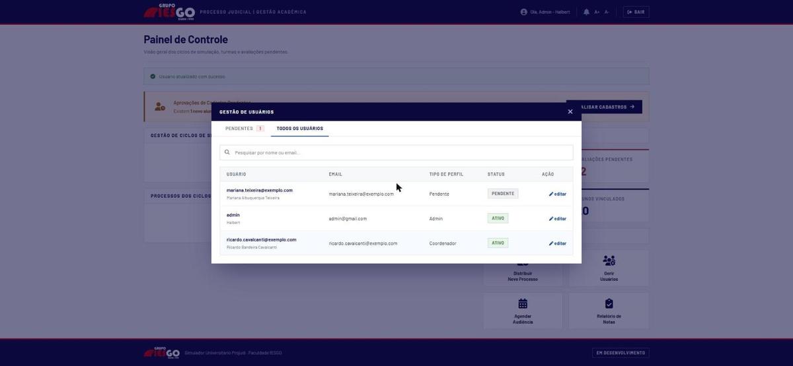

> ⚠️ Os dois campos (perfil e "Ativo") precisam ser preenchidos manualmente — não existe um botão
> único de "aprovar com um clique" que já libera o acesso automaticamente.

### 3. Como Criar um Ciclo de Simulação

*Pré-requisito: nenhum. Um Ciclo de Simulação representa um semestre letivo do NPJ.*

1. No Painel de Controle, clique em **+ Novo Ciclo**.
2. Preencha o **Nome/Edição do Ciclo** (ex.: "NPJ Cível 2026/2").
3. Escolha o **Semestre** (1º ou 2º) e confira o **Ano**.
4. Clique em **Salvar Ciclo**.

**Resultado:** o ciclo aparece na lista "Gestão de Ciclos de Simulação", com status **Em
andamento**, e quem criou o ciclo é automaticamente registrado como o "Responsável" por ele.

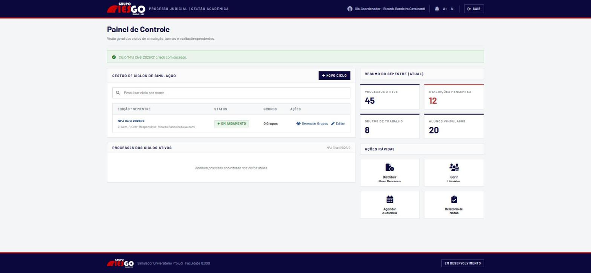

> ⚠️ Não existe campo para escolher outra pessoa como responsável no momento da criação — quem cria
> o ciclo sempre vira o responsável por ele. Para atribuir o ciclo a outro Coordenador ou Professor,
> é preciso **editar** o ciclo depois de criado.

### 4. Como Criar um Grupo de Trabalho e Adicionar Alunos

*Pré-requisito: o ciclo já precisa existir. Um Grupo de Trabalho representa uma equipe de alunos
atuando com um papel específico no processo simulado (ex.: um "escritório de advocacia" do Polo
Ativo).*

1. Na lista de ciclos, clique em **Gerenciar Grupos** no ciclo desejado.
2. Clique em **+ Novo Grupo**.
3. Preencha o **Nome do Grupo** (ex.: "Albuquerque & Associados") e escolha o **Papel Processual**
   (Serventia/Cartório, Advogados Polo Ativo, Advogados Polo Passivo, Ministério Público ou Juiz).
4. Clique em **Salvar**.
5. Com o grupo selecionado na lista à esquerda, use o campo **Adicionar ao Grupo** para buscar um
   aluno pelo nome ou e-mail, e clique em **+ Add** ao lado do nome dele.

**Resultado:** o aluno passa a fazer parte do grupo e do ciclo. No login seguinte, ele deixa de ver
a tela "Aguardando Vínculo" e passa a ver sua Área do Aluno normalmente, com o grupo e os
processos vinculados a ele.

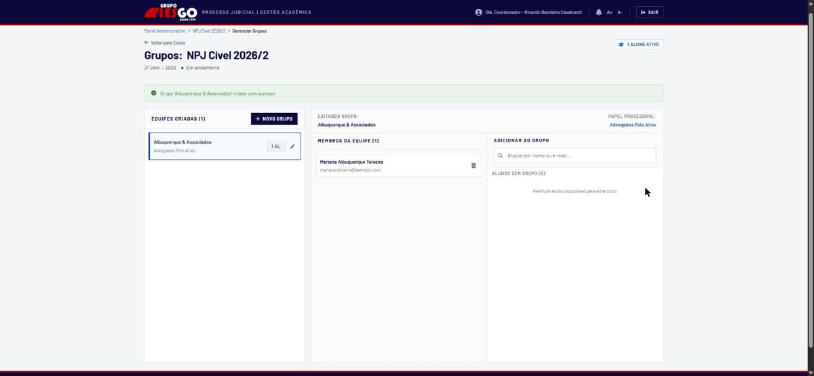

> ⚠️ Um aluno só pode estar em **um grupo por ciclo** — o sistema bloqueia a tentativa de colocá-lo
> em dois grupos do mesmo ciclo ao mesmo tempo.

---

## Capítulo do Coordenador

*Disponível para: perfil global **Coordenador**.*

O Painel de Controle do Coordenador é **idêntico** ao do Admin (mesmas seções: Gestão de Ciclos,
Resumo do Semestre, Ações Rápidas) — todos os passos do [Capítulo do Admin](#capitulo-admin) valem
também para o Coordenador: aprovar cadastros, criar ciclos, criar grupos e adicionar alunos.

Ao aprovar ou editar um usuário, o Coordenador **não pode atribuir o perfil "Admin"** a
ninguém — o seletor de Tipo de Perfil só oferece Coordenador, Professor e Aluno. Já o Admin pode
atribuir qualquer um dos quatro perfis.

*(Não há diferença de permissão a confirmar em "Distribuir Novo Processo" ou "Agendar
Audiência": como descrito no [Capítulo do Admin, seção 1](#admin-painel), essas duas ações não têm
nenhuma tela implementada por trás — a limitação é a mesma para qualquer perfil que acesse o
Painel de Controle, não uma questão de permissão do Coordenador.)*

---

---

## Capítulo do Professor

*Disponível para: perfil global **Professor**.*

O Professor usa o **mesmo Painel de Controle** dos outros perfis de gestão, mas com um recorte bem
mais restrito: ele só enxerga e administra os ciclos dos quais é responsável.

### 1. O que o Professor vê no Painel de Controle

- **Gestão de Ciclos de Simulação**: mostra **apenas os ciclos em que o Professor é o
  "Responsável"** — não a lista completa de ciclos do sistema, como no Admin/Coordenador. Um
  Professor recém-aprovado, sem nenhum ciclo atribuído a ele, vê "Nenhum ciclo de simulação
  cadastrado", mesmo que existam outros ciclos ativos no sistema.

  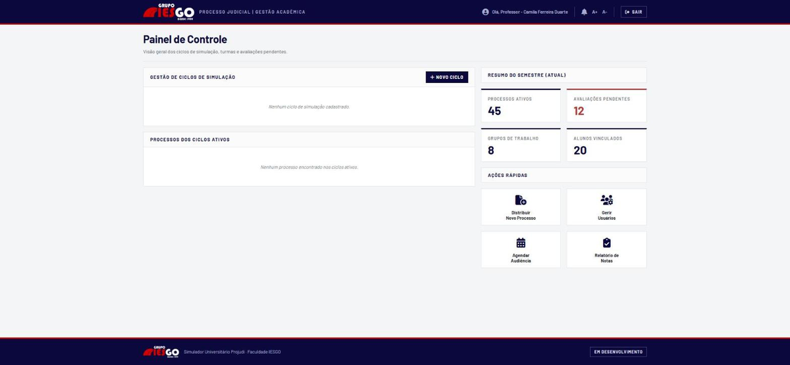

- Assim que um Coordenador (ou Admin) atribui o Professor como "Responsável" de um ciclo — pela
  tela de **editar ciclo** —, esse ciclo passa a aparecer normalmente para o Professor, com os
  mesmos botões "Gerenciar Grupos" e "Editar" que o Coordenador tem.

  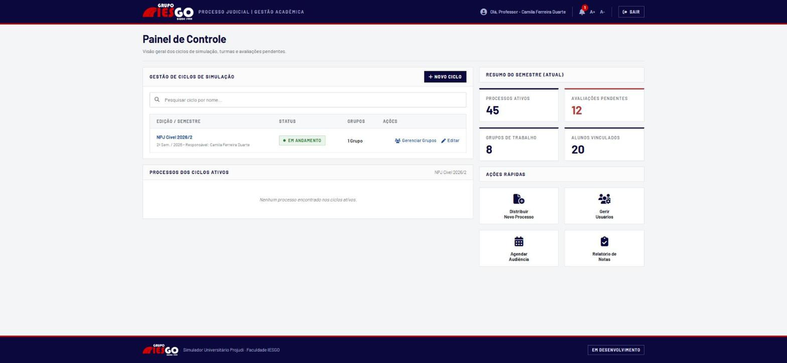

- **Gerir Usuários**: o Professor consegue ver a lista completa de usuários do sistema, mas só pode
  **aprovar ou editar cadastros atribuindo o perfil Aluno** — ao contrário do Coordenador (que pode
  atribuir Coordenador, Professor ou Aluno) e do Admin (que pode atribuir qualquer perfil).

  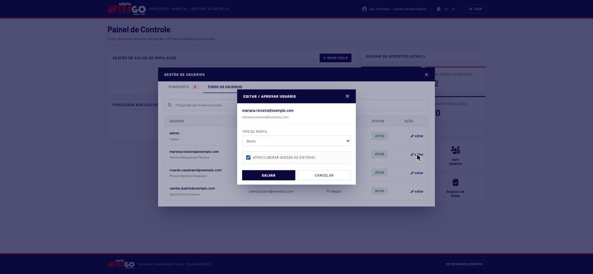

> ⚠️ Um Professor **não recebe automaticamente** os ciclos criados por outras pessoas. Se um
> Coordenador criar um ciclo, o Professor só vai enxergá-lo depois que alguém (Admin ou
> Coordenador) o atribuir como Responsável daquele ciclo, na tela de editar.

### 2. Como Vincular um Aluno a um Grupo de Trabalho

Depois de aprovar o cadastro de um Aluno (Painel de Controle → "Analisar Cadastros" → aprovar com o
Tipo de Perfil "Aluno" e marcar "Ativo"), o Aluno ainda não pertence a nenhum grupo — ele só passa
a ver processos e movimentações depois de ser colocado em um Grupo de Trabalho do ciclo.

1. No Painel de Controle, clique em **"Gerenciar Grupos"** na linha do ciclo desejado (a mesma tela
   usada para [criar um Grupo de Trabalho](#admin-criar-grupo)).
2. Clique no grupo já existente ao qual o Aluno deve pertencer (ou crie um novo grupo com
   "+ Novo Grupo", escolhendo o **Papel na Simulação**: Serventia/Cartório, Advogados Polo Ativo,
   Advogados Polo Passivo, Ministério Público ou Juiz).
3. À direita, em **"Adicionar ao Grupo"**, a lista **"Alunos sem Grupo"** mostra apenas os alunos do
   ciclo que ainda não foram colocados em nenhuma equipe. Clique em **"+ ADD"** ao lado do nome do
   aluno desejado.
4. O aluno aparece imediatamente em **"Membros da Equipe"**, e o contador de alunos do grupo (no
   painel esquerdo) é atualizado.

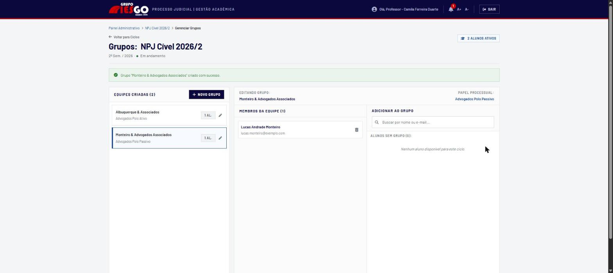

A partir desse momento, ao logar, o aluno passa a ver na "Área do Aluno" todos os processos
vinculados ao grupo dele, podendo movimentar e visualizar os autos conforme o papel processual do
grupo (Advogado, Serventia, Ministério Público ou Juiz).

> ℹ️ Um aluno só pode pertencer a **um grupo por vez** dentro do mesmo ciclo — por isso a lista
> "Adicionar ao Grupo" só mostra quem ainda está sem grupo.

### 3. Como Avaliar uma Movimentação (Atribuir Nota)

Sempre que um aluno registra uma movimentação em um processo, ela fica disponível para avaliação do
Professor responsável pelo ciclo.

1. Abra o processo (Painel de Controle → "Ver Autos" na linha do processo, ou pela lista de
   processos do ciclo) e role até a aba **"Eventos do Processo"**.
2. Na coluna "Opções" de cada linha da movimentação, o Professor vê um menu **"⋮"** (diferente do
   ícone de lápis que aparece para quem registrou a movimentação) — clique nele e escolha
   **"Avaliar"**.
3. A tela "Avaliação de Movimentação" mostra os dados completos da movimentação: autor, grupo
   responsável, tipo, data/hora, descrição e os arquivos anexados (com botões "Visualizar" e
   "Baixar" para conferir o conteúdo antes de avaliar).
4. Em **"Nota e Feedback"**, preencha:
   - **Nota (0 a 10)** — aceita casas decimais (ex.: `9,0`).
   - **Comentário ao Aluno** — texto livre, explicitamente marcado como "visível para" o aluno
     autor da movimentação.
5. Clique em **"Concluir Avaliação"**. Uma caixa de confirmação resume o aluno e a nota antes de
   enviar definitivamente — clique em **"Confirmar e Enviar"**.

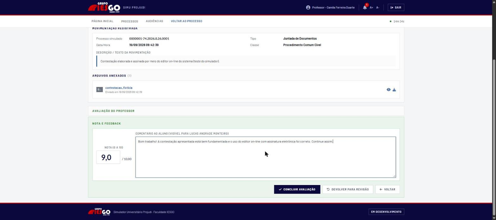

Existe também o botão **"Devolver para Revisão"**, para os casos em que o Professor quer que o
aluno corrija e reenvie o documento antes de receber uma nota — esse fluxo ainda não foi testado em
detalhe.

> ℹ️ O painel "Resumo do Semestre" do Professor mostra um contador de **"Avaliações Pendentes"** —
> é razoável supor que ele conta as movimentações ainda não avaliadas, mas isso não foi confirmado
> comparando o número antes/depois de uma avaliação nesta rodada de testes.

### 4. Como Bloquear/Desativar um Cadastro

O mesmo formulário usado para aprovar um cadastro também serve para bloquear o acesso de alguém já
ativo.

1. Painel de Controle → **"Gerir Usuários"** → aba **"Todos os Usuários"**.
2. Clique em **"editar"** na linha do usuário a ser bloqueado.
3. Desmarque a caixa **"Ativo (liberar acesso ao sistema)"** e clique em **"Salvar"**.

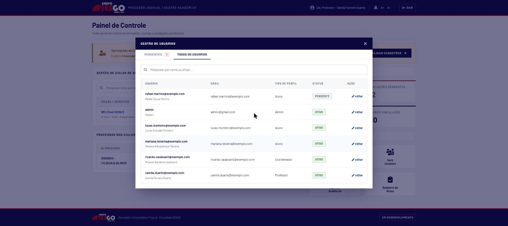

> ⚠️ Desmarcar "Ativo" **não cria um status "Inativo" separado**: o usuário simplesmente volta a
> aparecer como **"Pendente"** na aba de aprovações — como se nunca tivesse sido aprovado. Não há,
> por enquanto, uma distinção visual entre "nunca aprovado" e "aprovado e depois bloqueado".

Ao tentar logar, o usuário bloqueado recebe a mesma mensagem genérica usada para qualquer erro de
login ("Por favor, entre com um usuário e senha corretos"), mesmo digitando a senha correta — o
sistema não informa que a conta foi desativada.

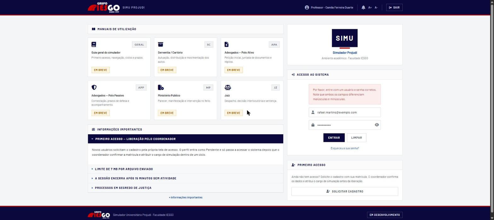

> ℹ️ O Professor só pode bloquear/reativar cadastros do tipo **Aluno** (mesma restrição de
> `tipos_que_pode_atribuir()` que vale para aprovação — ver [Capítulo do Professor, seção sobre
> Gerir Usuários](#capitulo-professor)). Bloquear um Coordenador ou outro Professor exige o perfil
> Admin ou Coordenador.

*(Como descrito no [Capítulo do Admin, seção 1](#admin-painel), "Distribuir Novo Processo",
"Agendar Audiência" e "Relatório de Notas" são ações sem nenhuma tela implementada por trás —
não é uma limitação específica do perfil Professor, e por isso não há nada a documentar sobre o
uso dessas três ações neste momento.)*

---

## Capítulo do Aluno

*Disponível para: perfil global **Aluno**.*

### 1. Para onde o Aluno é redirecionado, dependendo do vínculo

O que o Aluno vê depende de já ter sido colocado em um grupo de trabalho de um ciclo ou não:

- **Aluno aprovado mas ainda sem grupo**: ao logar, é redirecionado para `/ciclos/boas-vindas/`, com um cartão
  "Situação do Cadastro: Aguardando Vínculo" explicando que é o Professor ou o Coordenador do
  ciclo quem inclui o aluno em um grupo e define o cargo de simulação (Serventia, Advogado,
  Ministério Público ou Juiz).

  

- **Aluno já vinculado a um grupo de trabalho**: ao logar, é direcionado direto para a "Área do Aluno"
  (`/processos/area-servidor/`), já mostrando o nome do grupo e o cargo processual do grupo no
  cabeçalho (por exemplo, "Albuquerque & Associados — Advogados Polo Ativo").

> ⚠️ Só quem inclui o Aluno em um grupo é o Professor responsável pelo ciclo ou o Coordenador —
> o Aluno não escolhe nem solicita entrar em um grupo pela própria tela.

### 2. Área do Aluno — visão geral

A página inicial do Aluno mostra, no topo, o nome do grupo e o cargo processual, e logo abaixo um
bloco "Consultar Processos" (busca por número/classe/situação) e uma lista "Processos Vinculados".
Enquanto nenhum processo foi distribuído para o grupo, a lista aparece vazia, com a mensagem
"Nenhum processo vinculado ao seu usuário.".

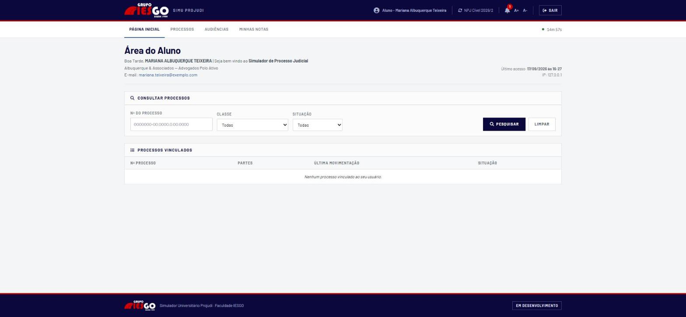

O menu superior do Aluno tem 4 itens: **Página Inicial**, **Processos**, **Audiências** e
**Minhas Notas**.

### 3. Menu "Processos"

O menu "Processos" abre um submenu com duas opções:

- **Cadastrar Processos**: leva a um formulário funcional de "Cadastro de Processo Comum", em 3
  passos (Dados do Processo → Documentos → Resumo), já mostrando o ciclo ativo do aluno no topo
  ("Ciclo ativo: NPJ Cível 2026/2 — 2º/2026"). Documentado em detalhe na seção [7. Como Cadastrar
  um Processo](#aluno-cadastrar-processo), mais adiante neste capítulo.
- **Consultar Todos**: **confirmado por leitura de código** (`base/templates/base/components/_nav_secundaria.html`)
  como funcionalidade não implementada — o link é `href="#"`, sem nenhuma view por trás.

### 4. Menu "Audiências"

O item "Audiências" do menu superior também é **confirmadamente não implementado**: o link é
`href="#"` (mesmo componente `_nav_secundaria.html` do item anterior), e o app `agendamentos/` do
backend — que seria o responsável por essa funcionalidade — não possui sequer um arquivo `urls.py`
próprio; os modelos e views existentes nele são só o esqueleto padrão gerado pelo Django, nunca
conectados a nenhuma rota. Um comentário no código de `movimentacoes/services.py` confirma que
esse é um ponto de conexão reservado para o futuro ("Ponto de conexão pra Prazos/Audiências —
nenhum dos dois módulos existe ainda"). Trate como funcionalidade planejada, não como um bug de
permissão ou de perfil.

### 5. "Minhas Notas"

"Minhas Notas" é um link funcional (`/avaliacoes/minhas-notas/`) e mostra o painel "Meu Desempenho"
do Aluno: nome/e-mail, três indicadores (Média Geral, Avaliadas, Melhor Nota) e um "Histórico de
Avaliações". Sem nenhuma movimentação avaliada ainda, os indicadores aparecem como "—"/"0" e o
histórico mostra "Nenhuma avaliação recebida ainda.".

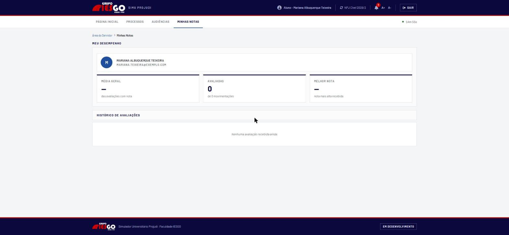

Depois que o Professor [avalia uma movimentação](#professor-avaliar-movimentacao), essa mesma tela
passa a mostrar a nota real: os três indicadores são preenchidos, aparece um aviso de "Última
avaliação" (com professor, movimentação e nota) e a tabela "Histórico de Avaliações" lista cada
movimentação avaliada, com abas para filtrar "Todas" / "Com Nota" / "Sem Nota" e um ícone de "olho"
para reabrir o comentário completo do professor.

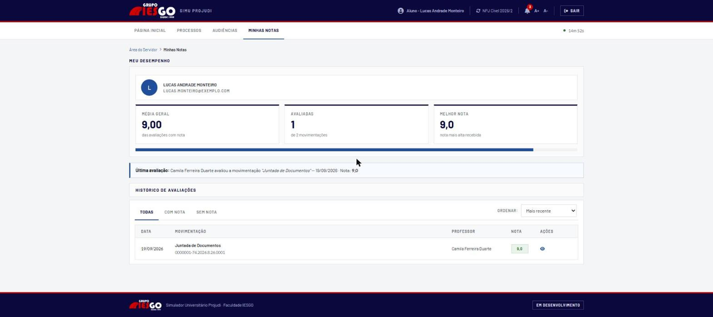

### 6. Notificações

O sino de notificações no cabeçalho mostra um contador (badge) com a quantidade de notificações
não lidas. Ao clicar, abre um painel com as notificações recentes — por exemplo, o próprio evento
de ter sido adicionado a um grupo aparece como notificação: *"Você foi adicionado ao ciclo 'NPJ
Cível 2026/2'."*, com a marcação de há quanto tempo (ex.: "18 minutos atrás") e um link "Ver
todas".

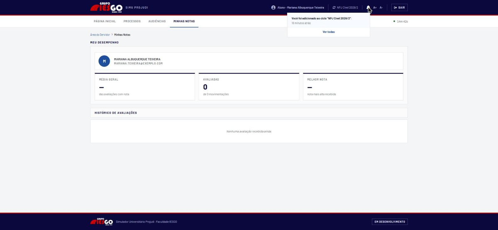

Outros eventos também geram notificação para o Aluno: o grupo dele ser vinculado a um processo
("Seu grupo foi vinculado ao processo '...' como Advogados Polo Passivo") e uma nova movimentação
ocorrer em um processo do qual participa ("Nova movimentação em '...': Autuação e Distribuição").
A página completa de notificações (`/notificacoes/`, acessível pelo link "Ver todas") lista todo o
histórico, mais recente primeiro.

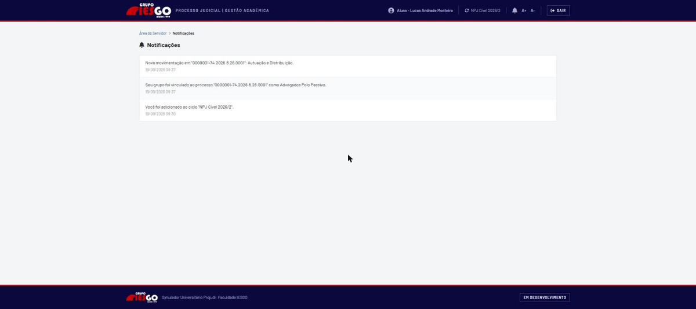

> Uma visão comparativa de notificações em outros perfis (Professor/Coordenador) e uma observação
> importante sobre o que **não** gera notificação está na seção [Notificações do
> Sistema](#notificacoes-sistema), ao final deste capítulo.

### 7. Como Cadastrar um Processo

O item "Cadastrar Processos" do menu "Processos" abre um formulário funcional de 3 passos.

> ⚠️ O campo "*Assunto(s)" aparece marcado como obrigatório (`*`), mas na prática **não bloqueia o
> cadastro** mesmo em branco — é um campo apenas visual nesta versão do sistema.

**Passo 1 — Dados do Processo**: Tipo do Processo, Comarca, Vara/Serventia, Classe Processual,
Valor da Causa (com opção de marcar Segredo de Justiça) e as partes do processo (Polo Ativo, Polo
Passivo e, opcionalmente, Substituto Processual/Outras Partes). Para cada polo, é possível buscar
uma parte já cadastrada ou clicar em "+ Cadastrar Nova" para criar uma parte fictícia na hora
(Nome/Razão Social, CPF/CNPJ e Tipo de Pessoa — Física ou Jurídica). A Vara/Serventia só mostra as
varas da Comarca escolhida.

**Passo 2 — Documentos**: permite anexar arquivos ao processo (PDF, DOCX, JPG, JPEG — até 7 MB por
arquivo), mas **não é obrigatório**: dá para avançar sem anexar nada.

**Passo 3 — Resumo**: mostra um resumo de conferência (dados do processo, partes e documentos)
antes de confirmar. Ao clicar em "Cadastrar Processo", o sistema gera automaticamente o número do
processo no padrão CNJ (`NNNNNNNN-DD.AAAA.J.TR.OOOO`) — o usuário não digita esse número.

O processo cadastrado aparece imediatamente na lista "Processos Vinculados" da Área do Aluno, com
situação "Protocolado".

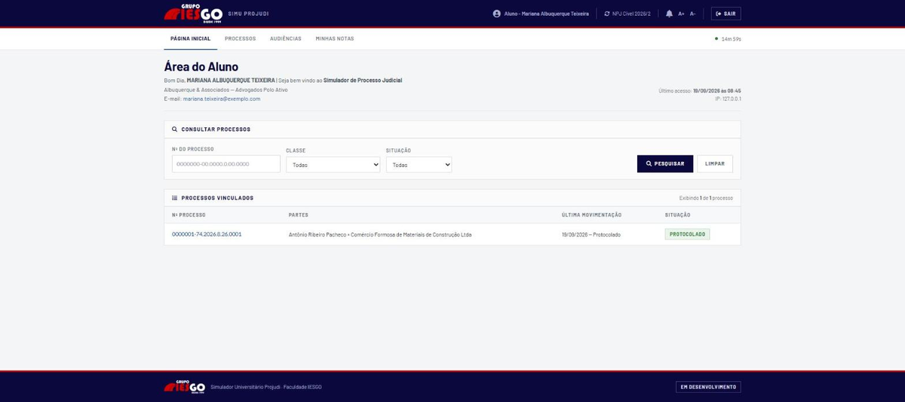

### 8. Detalhe do Processo

Ao clicar no número do processo na lista, abre a tela "Autos", com os dados completos do processo
(polos, vara/comarca, classe, valor da causa, status, ciclo e grupos vinculados) e, logo abaixo, três
abas: **Eventos do Processo** (linha do tempo das movimentações), **Índice Processo** e **Navegação
de Arquivo**.

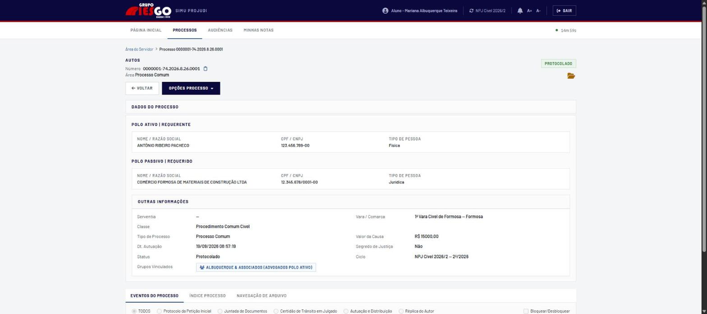

O botão "Opções Processo" abre um menu com as ações disponíveis para o Aluno/Advogado do grupo:
**Marcar Audiência**, **Partes**, **Visualizar** e **Movimentar** — visualmente todas parecem
habilitadas (não ficam acinzentadas), mas **"Marcar Audiência" não tem nenhuma ação por trás**
(mesma situação do item "Audiências" do menu superior, descrita no item anterior — nada acontece
ao clicar). A opção **"Modificar Dados" aparece desabilitada** para esse perfil.

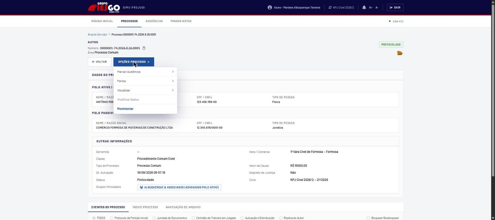

### 9. Como Movimentar um Processo

Em "Opções Processo → Movimentar", o formulário pede o **Tipo de Movimentação** (lista suspensa,
com a observação "Preencher conforme TPU CNJ para alimentar estatística de produtividade"), uma
descrição livre e, opcionalmente, documentos anexados. Também é feito em 2 passos, com uma tela de
revisão antes de confirmar.

> ⚠️ Os tipos de movimentação disponíveis no formulário mudam conforme o papel processual de quem
> está logado. Testado com um Aluno do grupo "Advogados Polo Ativo": só apareceu a opção **"Juntada
> de Documentos"**. Tipos como despacho ou sentença devem ficar reservados a outros papéis (Juiz,
> Serventia) — ainda não confirmado; ver capítulos desses perfis quando forem escritos.

Depois de confirmada, a movimentação aparece na aba "Eventos do Processo" do detalhe do processo,
junto com a movimentação automática "Protocolo da Petição Inicial" gerada no momento do cadastro —
cada evento mostra número sequencial, descrição, data/hora e o usuário responsável.

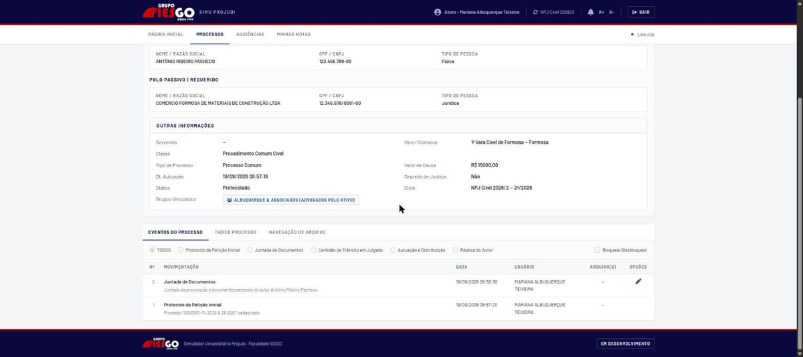

### 10. Como Anexar um Documento em uma Movimentação

No **Passo 1** de "Movimentar Processo", a seção "Documentos da Movimentação" tem duas abas:
"Upload de Arquivos" e "Modelos, Editor On-line" (coberto na próxima seção). Para anexar um arquivo
já pronto (PDF, DOC, DOCX, ODT, JPG ou PNG, até 10MB):

1. Arraste o arquivo para a área pontilhada, ou clique nela para abrir o seletor de arquivos do
   sistema operacional.
2. Depois do upload, o sistema pede um **"Título do Arquivo"** para cada documento (obrigatório)
   antes de incluí-lo na lista — confirme com o ícone de "✓".
3. O documento passa a aparecer em **"Documentos a Anexar"**, com opções de editar o título (lápis)
   ou remover (lixeira).
4. Clique em **"Avançar"**, confira o resumo no Passo 2 e clique em **"Confirmar Movimentação"**.

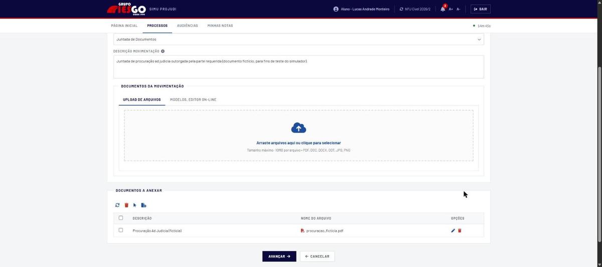

Depois de confirmada, o documento aparece anexado à movimentação na aba "Eventos do Processo": o
número de arquivos aparece na coluna "Arquivo(s)" (ex.: "˅ 1") — clique na seta para expandir e ver
o(s) documento(s) daquele evento, com botões **"Visualizar"** (abre em nova aba) e **"Baixar"**.

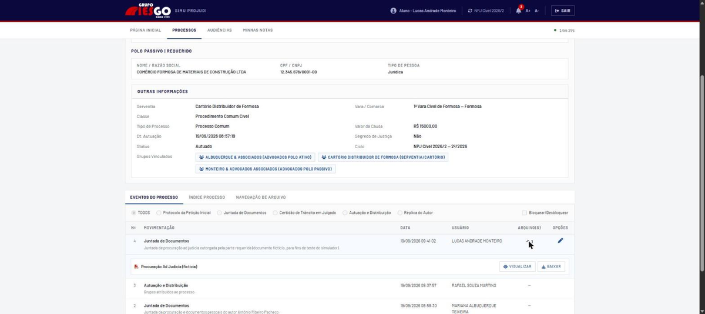

> ℹ️ Não existe, por enquanto, uma tela central que liste "todos os documentos do processo" fora do
> contexto de cada movimentação — para juntar as peças de um processo é preciso abrir cada evento
> na aba "Eventos do Processo" (ou usar a aba "Navegação de Arquivo", ainda não testada em
> detalhe).

### 11. Como Usar o Editor On-line para Criar e Assinar um Documento

A aba **"Modelos, Editor On-line"** (ao lado de "Upload de Arquivos", no mesmo Passo 1 de
"Movimentar Processo") permite redigir um documento diretamente no navegador, sem precisar montar
um arquivo antes.

1. Clique na aba **"Modelos, Editor On-line"**.
2. Opcionalmente, escolha um **modelo de documento** pronto no seletor "Carregar Modelo de
   Documento" (ou continue de um **rascunho salvo** anteriormente, com "Abrir Rascunho (.html)") —
   qualquer um dos dois **substitui o conteúdo atual do editor**.
3. Preencha o **"Nome do Arquivo para Salvar"**.
4. Escreva o texto no editor (formatação de texto rico: negrito, itálico, listas, tabelas, links,
   imagens, alinhamento etc. — barra de ferramentas parecida com um processador de texto comum).
5. No rodapé do editor há três botões:
   - **"Assinar"** — insere automaticamente, ao final do texto, um bloco "ASSINADO
     ELETRONICAMENTE" com o nome do usuário logado e a data/hora, simulando uma assinatura
     eletrônica.
   - **"Incluir na Movimentação"** — adiciona o conteúdo atual do editor à lista de "Documentos a
     Anexar" da movimentação (mesma lista usada pelo upload de arquivos).
   - **"Salvar Rascunho"** — guarda o conteúdo sem incluir na movimentação, para continuar depois.

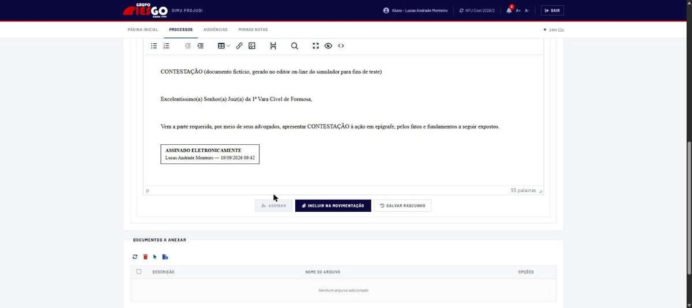

6. Depois de clicar em "Assinar" (opcional, mas recomendado antes de protocolar uma peça) e depois
   em **"Incluir na Movimentação"**, o documento aparece em "Documentos a Anexar" com a extensão
   `.html` — o restante do fluxo (Avançar → Revisão → Confirmar Movimentação) é idêntico ao do
   upload de arquivo comum.

> ⚠️ A assinatura eletrônica do editor é **apenas simbólica** (só insere um texto no próprio
> documento) — não é uma assinatura digital com certificado, nem gera nenhum arquivo separado de
> verificação.

### 12. Papel de Serventia/Cartório (SC): Vincular um Grupo a um Processo

Vincular um **segundo grupo** (por exemplo, o time de advogados da parte contrária) a um processo
que já foi protocolado **não é feito pelo Professor nem pelo próprio grupo interessado** — é uma
ação exclusiva de quem pertence a um grupo com o papel processual **"Serventia/Cartório" (SC)**,
feita pela própria "Área do Aluno" desse usuário.

1. Logado como um aluno de um grupo com papel "Serventia/Cartório", a "Área do Aluno" lista **todos
   os processos do ciclo** (não só os do seu próprio grupo) em "Processos da Vara", com uma coluna
   "Ações" contendo um ícone de pessoas.
2. Clique nesse ícone na linha do processo desejado para abrir o modal **"Atribuir Grupo ao
   Processo"**.
3. O modal lista todos os grupos do ciclo, marcando os que **já estão vinculados** com a etiqueta
   "JÁ VINCULADO". Marque o(s) grupo(s) adicional(is) que devem passar a responder pelo processo
   (a seleção é **aditiva** — marcar um novo grupo não remove os já vinculados).
4. Existe também a opção **"Remover atribuição"**, que desvincula **todos** os grupos do processo de
   uma vez (não é possível remover apenas um grupo específico por essa tela).
5. Clique em **"Confirmar Atribuição"**.

Depois de confirmado, o campo "Grupos Vinculados" do processo passa a mostrar todos os grupos
atribuídos, incluindo o próprio grupo de Serventia/Cartório que fez a atribuição — e, se ainda não
houvesse serventia definida, o campo "Serventia" do processo é preenchido automaticamente com o
nome desse grupo. O status do processo também pode avançar automaticamente (no teste desta rodada,
foi de "Protocolado" para "Autuado").

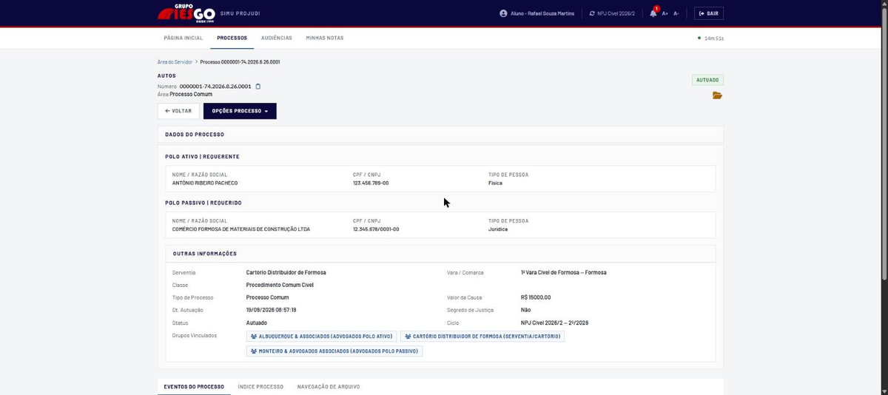

> ℹ️ Como consequência, **todo processo que vai envolver mais de um grupo** (por exemplo, uma ação
> com advogados dos dois polos) depende de existir, no ciclo, pelo menos um grupo com o papel
> "Serventia/Cartório" e pelo menos um aluno vinculado a ele — sem isso, não há como atribuir o
> segundo grupo pela interface.

## Notificações do Sistema

*Disponível para todos os perfis.*

O sino de notificações, no canto superior direito de qualquer tela logada, mostra um contador
vermelho com a quantidade de notificações não lidas. Clicar nele abre um menu com as notificações
mais recentes (data relativa, ex. "6 minutos atrás") e um link **"Ver todas"**, que leva à página
completa `/notificacoes/`. Os exemplos de notificação do Aluno (vínculo ao ciclo, grupo vinculado a
um processo, nova movimentação) estão na seção ["Minhas Notas"/"Notificações" do Capítulo do
Aluno](#capitulo-aluno).

O conteúdo muda conforme o perfil logado — por exemplo, o **Professor/Coordenador** recebe
notificação ao ser designado responsável (coordenador) por um ciclo ("Você foi designado
coordenador do ciclo '...'"):

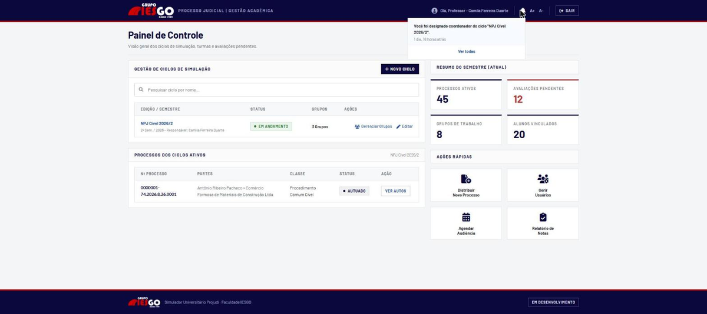

> ⚠️ Nem toda ação gera notificação: **atribuir uma nota a uma movimentação não gerou nenhuma
> notificação** para o aluno avaliado nesta rodada de testes — o aluno só fica sabendo da nota
> abrindo a tela "Minhas Notas" manualmente. Da mesma forma, uma nova movimentação de um aluno não
> gerou notificação visível para o Professor responsável pelo ciclo.

---

*(Próximos capítulos: capítulo dos perfis Serventia/Cartório, Ministério Público e Juiz;
"Distribuir Novo Processo" e "Agendar Audiência" do Professor; revisão geral do manual e Apêndice
de capturas de tela — em produção.)*
